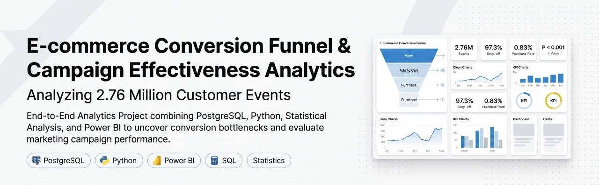
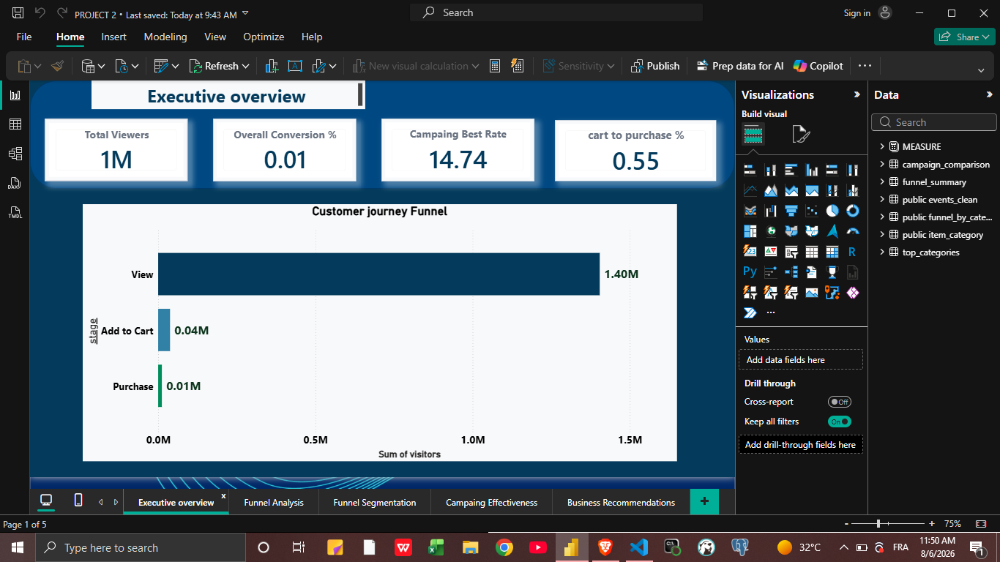
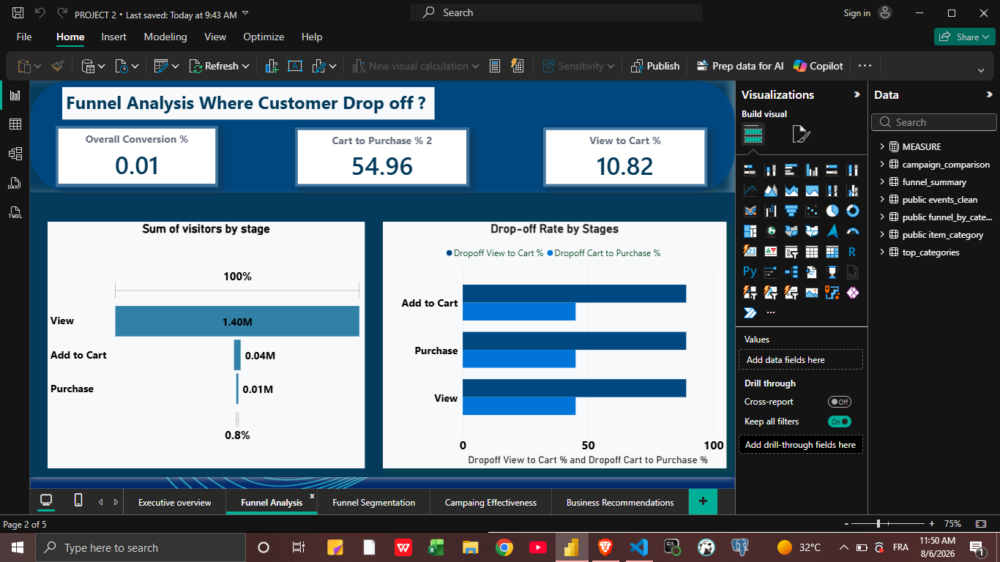
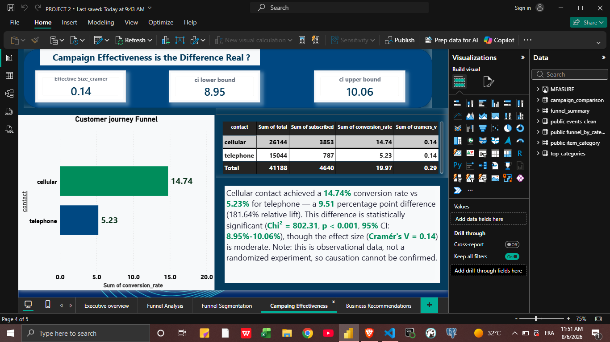
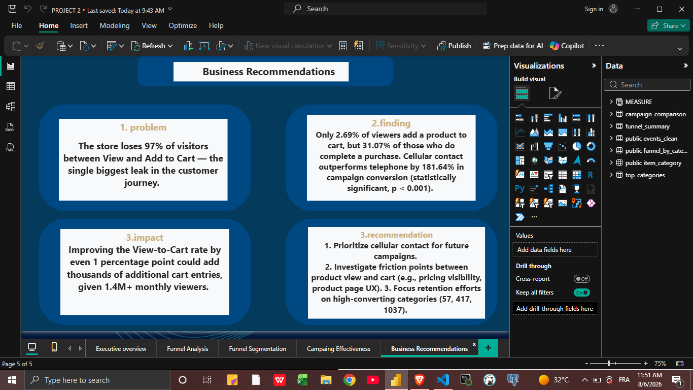
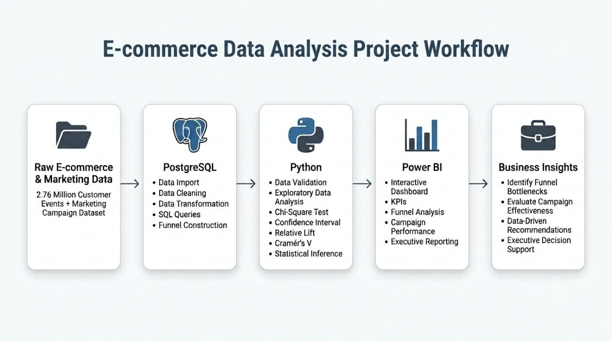
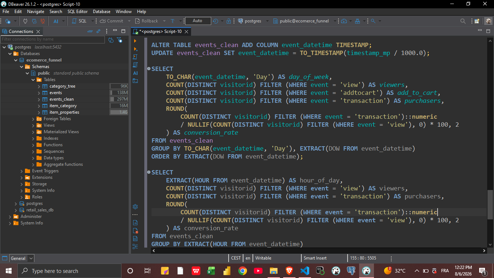
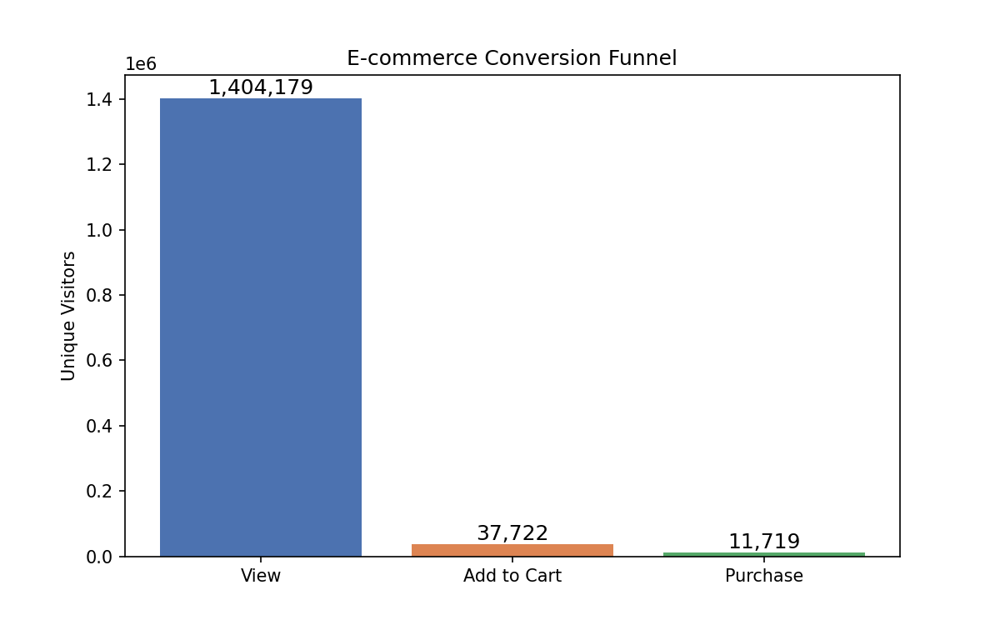
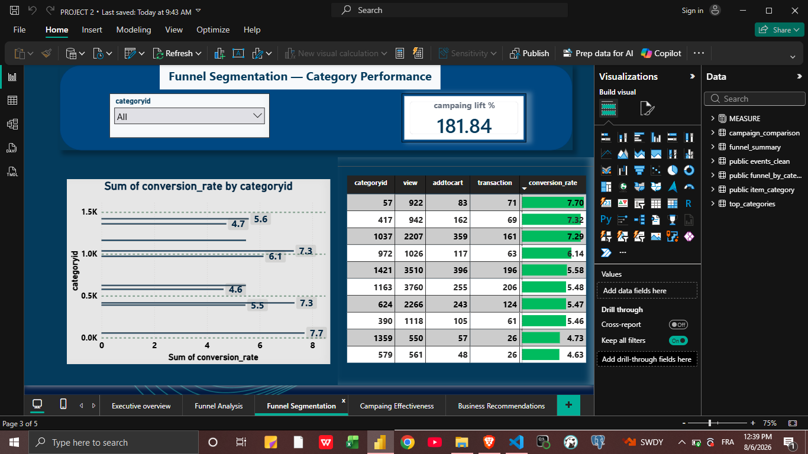

# 🚀 E-commerce Conversion Funnel & Campaign Effectiveness Analytics

> **An end-to-end analytics project analyzing 2.76 million customer events to identify conversion bottlenecks and evaluate marketing campaign effectiveness using PostgreSQL, Python, and Power BI.**

  

 

---

# 📖 Executive Summary

E-commerce companies generate millions of customer interactions every day, but understanding **where customers abandon the purchasing journey** and **whether marketing campaigns truly improve conversions** remains a major business challenge.

This project analyzes **2.76 million customer events** through a complete analytics workflow using **PostgreSQL**, **Python**, and **Power BI**. The analysis identifies the largest conversion bottleneck, evaluates campaign performance using statistical hypothesis testing, validates analytical results across multiple tools, and transforms complex findings into executive-ready business insights.

Rather than building dashboards alone, this project demonstrates the complete analytics lifecycle—from raw data engineering and statistical validation to interactive business intelligence and evidence-based recommendations.

---

# ❓ Business Questions

This project answers the following strategic business questions:

- Where do customers abandon the purchasing journey?
- Which funnel stage represents the greatest optimization opportunity?
- Which marketing communication channel delivers the highest conversion rate?
- Are the observed campaign differences statistically significant?
- How can analytical findings be translated into actionable business recommendations?

---

# ⭐ Executive Highlights

| Metric | Result |
|---------|-------:|
| Customer Events Analyzed | **2.76 Million** |
| Product Views | **1,404,179** |
| View  Cart Conversion | **2.69%** |
| Overall Purchase Conversion | **0.83%** |
| Largest Funnel Drop-off | **97.3%** |
| Best Performing Campaign | **Cellular** |
| Statistical Significance | **P < 0.001** |
| Relative Lift | **181.64%** |

---

# 🎯 Project Highlights

- Analyzed **2.76 million** customer events.
- Built a complete **View → Add to Cart → Purchase** conversion funnel.
- Identified the largest customer drop-off within the purchasing journey.
- Validated SQL outputs independently using Python.
- Applied statistical hypothesis testing using the **Chi-Square Test of Independence**.
- Reported **Confidence Intervals**, **Relative Lift**, and **Effect Size (Cramér's V)**.
- Designed a **five-page interactive Power BI dashboard**.
- Delivered business recommendations supported by statistical evidence.

---

# 📸 Project Gallery

# Executive Overview

  

---

# Funnel Analysis

  

---

# Campaign Effectiveness

  

---

# Business Recommendations

  

---

# 🏗️ Solution Architecture

  

This project follows a complete analytics workflow that transforms raw customer events into actionable business insights through three integrated stages:

- **Data Engineering** using PostgreSQL
- **Statistical Validation** using Python
- **Executive Reporting** using Power BI

The objective is not only to measure business performance, but also to ensure that every conclusion is supported by reliable data and statistical evidence.

---

# ⚙️ Technology Stack

| Layer | Technologies |
|--------|--------------|
| Database | PostgreSQL |
| SQL | CTEs • Views • Window Functions • FILTER • Aggregate Functions |
| Programming | Python |
| Libraries | Pandas • NumPy • SciPy • Statsmodels |
| Visualization | Power BI |
| Analytics | DAX • Statistical Inference |

---

---

# 🗄️ PostgreSQL — Data Engineering

  

Before performing any analysis, the raw datasets were cleaned, validated, and transformed into reliable analytical tables.

### Key Activities

- Imported **2.76 million** customer events.
- Removed duplicate records.
- Corrected timestamp formatting issues.
- Validated data consistency.
- Built the complete customer conversion funnel.
- Generated reusable analytical datasets using SQL.

---

# 🐍 Python — Data Validation & Statistical Analysis

> **🖼️ (ضع هنا لقطة شاشة من Jupyter Notebook تعرض جزءًا من الكود والنتائج.)**

Python was used to independently validate SQL outputs and verify that business conclusions were statistically reliable before being presented to decision-makers.

### Validation Process

- Data Quality Assessment
- Missing Value Inspection
- Duplicate Verification
- SQL Cross-Validation
- Statistical Hypothesis Testing

---

## Statistical Methods

- Chi-Square Test of Independence
- P-value
- 95% Confidence Interval
- Relative Lift
- Cramér's V (Effect Size)

To prevent misleading conclusions, the **duration** feature was intentionally excluded because it introduces **data leakage**, making it unsuitable for campaign performance evaluation.

  

---

# 📊 Power BI — Executive Dashboard

  

The final analytical outputs were transformed into an interactive Power BI dashboard designed to support operational monitoring and executive decision-making.

### Dashboard Features

- Executive KPI Cards
- Interactive Slicers
- Conversion Funnel Analysis
- Campaign Performance Comparison
- Category Performance Analysis
- Statistical Summary
- Business Recommendations

📄 View the complete Power BI Dashboard:

[Download Power BI Dashboard PDF](powerbi/dashboard.pdf)

---
# 📈 Key Findings

This analysis uncovered two major business opportunities: improving the early stages of the purchasing journey and optimizing marketing communication strategy through evidence-based decision-making.

---

# 🛒 Conversion Funnel Performance

| Funnel Stage | Users | Conversion Rate |
|--------------|------:|----------------:|
| Product View | 1,404,179 | — |
| Add to Cart | 37,722 | **2.69%** |
| Purchase | 11,719 | **31.07%** |

### Key Insights

- Overall **View-to-Purchase Conversion** reached **0.83%**.
- Nearly **97.3%** of visitors left before adding a product to their shopping cart.
- Once customers reached the cart, almost one-third completed a purchase.
- The primary business opportunity lies in increasing the **View → Add to Cart** conversion rate rather than optimizing the checkout process.

---

# 📢 Campaign Performance

| Metric | Cellular | Telephone |
|--------|----------:|----------:|
| Conversion Rate | **14.74%** | **5.23%** |
| Successful Conversions | 3,853 | 787 |
| Total Customers | 26,144 | 15,044 |

The **Cellular** communication channel consistently achieved a substantially higher conversion rate than **Telephone**, indicating a clear difference in customer response across campaign channels.

---

# 📊 Statistical Validation

| Metric | Result |
|---------|--------|
| Chi-Square Statistic | **802.31** |
| P-value | **< 0.001** |
| 95% Confidence Interval | **8.95% – 10.06%** |
| Relative Lift | **181.64%** |
| Effect Size (Cramér's V) | **0.14** |

### Interpretation

The statistical analysis indicates a highly significant association between communication channel and conversion performance.

However, because the analysis is based on **observational data** rather than a randomized experiment, the findings demonstrate **association—not causation**.

Reporting confidence intervals and effect size alongside the p-value provides a more complete and practical interpretation of the business impact.

---

# 💼 Business Impact

The analysis highlights a high-impact optimization opportunity.

With more than **1.4 million product views**, even a modest improvement in the **View → Add to Cart** conversion rate could generate thousands of additional shopping cart additions without increasing website traffic.

Likewise, prioritizing the better-performing communication channel offers the potential to improve marketing efficiency while maximizing return on investment.

---

# 🎯 Business Recommendations

  

## 1. Optimize the Largest Funnel Bottleneck

Focus on improving the **View → Add to Cart** stage by reviewing:

- Product page design
- Call-to-action placement
- Pricing visibility
- Customer reviews
- Shipping transparency
- Website loading speed

---

## 2. Prioritize the Better-Performing Campaign

Allocate a larger share of future marketing investment to the **Cellular** communication channel while continuously monitoring campaign performance over time.

---

## 3. Invest in High-Converting Categories

- Increase exposure for high-performing categories.
- Investigate low-performing categories.
- Replicate successful strategies across weaker product groups.

---

## 4. Continue Evidence-Based Decision Making

Future campaign evaluations should report:

- Conversion Rate
- Confidence Interval
- Effect Size
- Statistical Significance

rather than relying solely on percentage differences.

---

---
# ✅ Data Quality & Validation

Reliable insights begin with reliable data.  
Before any analysis was performed, both datasets were thoroughly validated to ensure accuracy, consistency, and analytical integrity.

---

## E-commerce Dataset

| Validation Check | Result |
|------------------|--------|
| Total Events | **2.76M+** |
| Duplicate Events | **460 removed** |
| Timestamp Issues | **Corrected** |
| Missing Product Categories | **~9.3%** |
| Impact on Funnel Metrics | **None** |

### Validation Summary

- Removed duplicate customer events.
- Corrected timestamp formatting issues.
- Verified event consistency before analysis.
- Confirmed that missing product categories affected only category-level reporting.

---

## Marketing Campaign Dataset

| Validation Check | Result |
|------------------|--------|
| Columns | **21** |
| Missing Values | **None** |
| Duplicate Rows | **12 (0.03%)** |
| Outliers | **Reviewed** |
| Unknown Categories | **Documented** |
| Data Leakage | **Prevented** |

### Validation Summary

- Confirmed dataset completeness.
- Reviewed duplicate observations.
- Validated categorical variables before statistical testing.
- Excluded the **duration** feature to prevent data leakage.

---

# 👨‍💻 About the Author

## Mokhtar Semghoun

I am an aspiring **Data Analyst** passionate about transforming raw data into actionable business insights through **SQL, Python, statistics, and data visualization**.

My projects focus on solving real-world business problems by combining **data engineering**, **statistical analysis**, and **interactive dashboards** to support evidence-based decision-making.

This project demonstrates my ability to build an end-to-end analytics solution—from raw data preparation and validation to statistical analysis, business intelligence, and executive reporting.

---

# 🤝 Connect With Me

---

# ⭐ If you found this project interesting, consider giving it a Star!

Thank you for taking the time to explore this project.